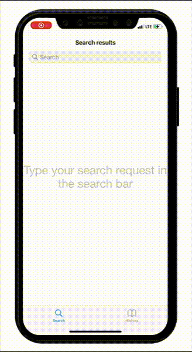

# YouTunes - поиск музыкальных альбомов в iTunes

Проект является тестовым заданием по одной из вакансий.
****
### Описание проекта
Приложение для iPhone должно отображать список альбомов, полученных с помощью API iTunes. Также пользователь может посмотреть подробную информацию об выбранном им альбоме.

Кроме того, история поиска должна сохраняться на устройстве. Пользователь должен видеть ее на второй вкладке. После тапа по одной из ячеек должен открываться результат поиска по соответсвующему запросу.

****
### Требования к выполнению проекта:
__Код должен быть:__
1. Завершенным
2. Хорошо коментированным
3. Иметь хорошую архитектуру
4. Устойчивым, разрешать ситуации с ошибками
5. Без багов, корректно компилируется и исполняется
6. Написан на Swift

__Описание UI:__

UITabBarController с двумя вкладками (Search, History):
1. Вкладка с UISearchBar для поиска:
    - UICollectionView с альбомами
    - после тапа по альбому необходимо отобразить экран с подробной информацией о выбранном альбоме и список песен (в обоих вкладках - Search и History)

2. Вкладка с историей поиска:
    - UITableView, отображающая историю поиска (текст, введенный в UISearchBar). История должна быть сохранена между запусками приложения.
    - По тапу на одну из ячеек должен открываться результат поиска по соответсвующему запросу.
****
### Что использовалось: 
При создании проекта были применены следующие инструменты:
- Архитектура: MVC
- Сеть: URLSession, iTunes API
- Паттерны: Singleton, Delegate
- GCD
- UserDefaults для хранения поисковых запросов
- UISearchBar, UICollectionView, UITableView, UIScrollView, UITabBarController, UINavigationController
- UIAlertControllers для вывода пользователю уведомлений об ошибках
- Codable для обработки данных с сервера
****
### Обработка ошибок

Особое внимание было уделено обработке возможных ошибок и уведомлению пользователя в случае их возникновения. Например, alert сработает в следующих случаях:
- Некорректно составленный запрос (например, были введены символы, которые не могут быть преобразованы для создания валидного URL)
- Пустой ответ с сервера (если, например, вести в поле поиска рандомный набор символов)
- Отсутствие соединения с Интернетом
- Ошибки, возвращаемые сервером
Во всех этих случаях пользователь увидит Alert с описанием ошибки.
